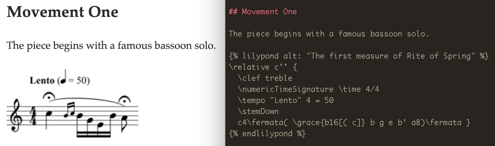

# jekyll-lilypond



Automatically generate sheet music images by adding Lilypond blocks to your markdown files. Customize the images
and the HTML markup surrounding them using Liquid attributes — for instance, by using the `alt` attribute to
specify alt text.

For complete documentation, see [the plugin website](https://www.velleman.org/jekyll-lilypond).


## Installation

The plugin requires Lilypond and ImageMagick. To use it in a Jekyll site,
add 

```ruby
gem 'jekyll-lilypond'
```

to your Gemfile and

```yaml
plugins:
  - jekyll-lilypond
```

to your `_config.yml`.

## Quick start

Inside the block, write a Lilypond music expression.
```

  a b c d e 

```
The expression can include multiple staves, expressive marks, time and key signature changes, and any of the other notation Lilypond supports within a music
expression. For details, see [this brief summary](https://lilypond.org/doc/v2.20/Documentation/learning/score-is-a-_0028single_0029-compound-musical-expression) in the Lilypond teaching manual or [Wikipedia's list of common music expression details](https://en.wikipedia.org/wiki/Help:Score#Syntax).
```

  \new PianoStaff <<
    \new Staff { \time 2/4 \key ees \major
      \tempo "siempre staccato"
      <g bes des' ees'>
      8 8 8 8 8 8 8 8 8 8_> 8 8_> 8 8 8 8
    }
    \new Staff { \clef bass \time 2/4 \key ees \major
      <fes,, aes,, ces, fes, >
      8 8 8 8 8 8 8 8 8 8_> 8 8_> 8 8 8 8
    }
  >>

```

To make customizations that can't be make within a music expression — for instance, to change the width or height of the score or specify a custom font —
use attributes on the `` tag. For more information on attributes, see [the plugin documentation](http://127.0.0.1:4000/jekyll-lilypond#attributes).

## Testing

`bundle exec rspec` runs tests. A minimal sample Jekyll site for tests to call on is in `spec/fixtures`, 
with the interesting details being the sample templates in `spec/fixtures/layouts`.
